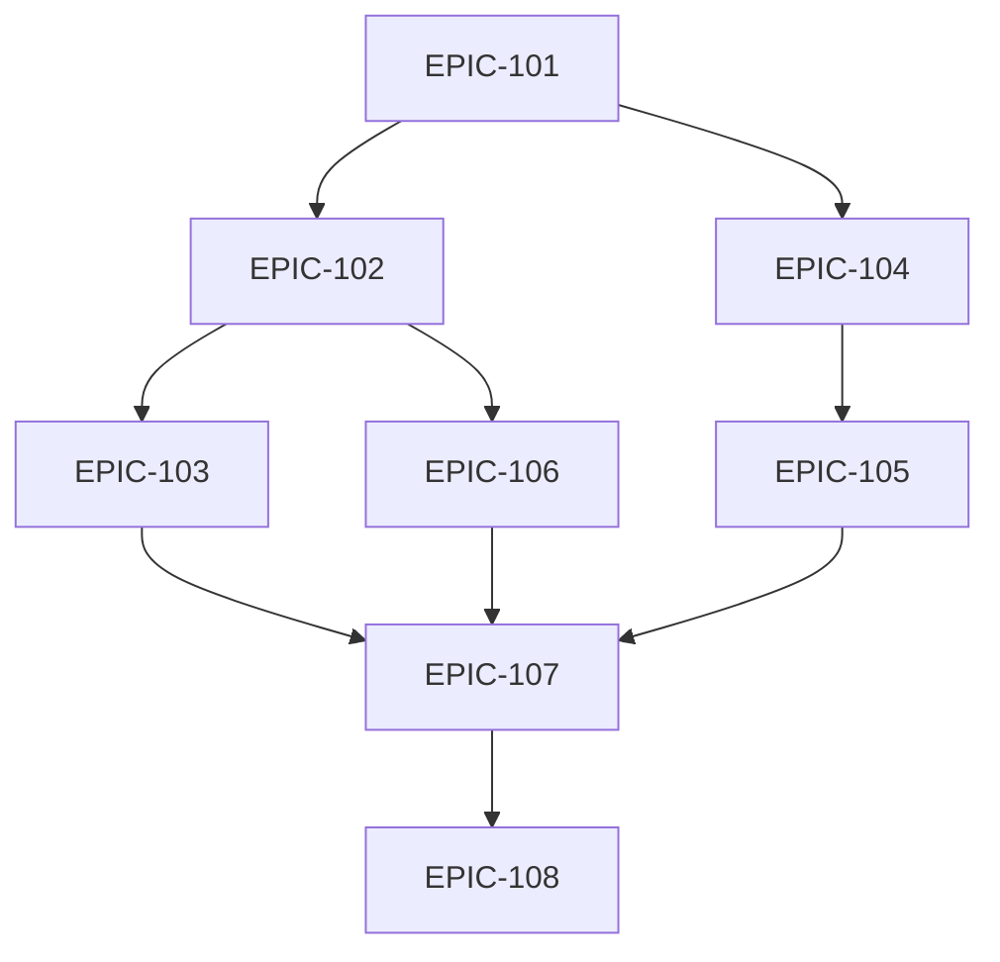

# MVP Production - Epic Planning

## 📊 Epic Structure for MVP Phase

### EPIC-101: Backend Infrastructure
**Priority:** P0 - Critical  
**Duration:** 1 week  
**Description:** Establish backend API and database architecture

**Goals:**
- Set up Node.js/Express server
- Design and implement database schema
- Create RESTful API endpoints
- Implement data validation
- Set up error handling

**Success Criteria:**
- API documentation complete
- All endpoints tested
- Database migrations ready
- Error handling robust

**Modules:**
- User Management API
- Booking System API
- Product Catalog API
- Order Management API

---

### EPIC-102: Authentication & Authorization
**Priority:** P0 - Critical  
**Duration:** 3 days  
**Description:** Implement secure user authentication system

**Goals:**
- User registration/login
- JWT token management
- Role-based access (Customer, Staff, Admin)
- Password reset functionality
- Session management

**Success Criteria:**
- Secure authentication flow
- Token refresh mechanism
- Role permissions enforced
- Password reset works

**Modules:**
- Auth Module
- User Profile Module
- Permission System

---

### EPIC-103: Payment Integration
**Priority:** P0 - Critical  
**Duration:** 4 days  
**Description:** Integrate Stripe for payment processing

**Goals:**
- Stripe SDK integration
- Payment method management
- Secure checkout flow
- Order confirmation
- Refund capabilities

**Success Criteria:**
- Test payments successful
- PCI compliance met
- Refund process works
- Payment receipts generated

**Modules:**
- Payment Module
- Order Processing
- Invoice Generation

---

### EPIC-104: Real-time Booking System
**Priority:** P0 - Critical  
**Duration:** 1 week  
**Description:** Transform static booking into dynamic system

**Goals:**
- Real-time availability checking
- Appointment scheduling
- Calendar integration
- Booking modifications
- Cancellation handling

**Success Criteria:**
- No double bookings
- Real-time updates
- Calendar sync works
- Notifications sent

**Modules:**
- Availability Engine
- Calendar Integration
- Booking Management

---

### EPIC-105: Notification System
**Priority:** P1 - High  
**Duration:** 3 days  
**Description:** Automated email and SMS notifications

**Goals:**
- Email service integration
- SMS capability
- Booking confirmations
- Reminder notifications
- Marketing emails

**Success Criteria:**
- Emails delivered reliably
- SMS working
- Templates professional
- Unsubscribe functional

**Modules:**
- Email Service
- SMS Service
- Template Engine
- Notification Queue

---

### EPIC-106: Admin Dashboard
**Priority:** P1 - High  
**Duration:** 1 week  
**Description:** Management interface for salon staff

**Goals:**
- Appointment management
- Customer management
- Product inventory
- Revenue reports
- Staff scheduling

**Success Criteria:**
- Intuitive interface
- Real-time data
- Export capabilities
- Mobile responsive

**Modules:**
- Dashboard UI
- Reporting Engine
- Data Export
- Analytics

---

### EPIC-107: Production Deployment
**Priority:** P0 - Critical  
**Duration:** 3 days  
**Description:** Deploy application to production environment

**Goals:**
- AWS infrastructure setup
- CI/CD pipeline
- SSL certificates
- Domain configuration
- Monitoring setup

**Success Criteria:**
- 99.9% uptime
- Automated deployments
- SSL working
- Monitoring active

**Modules:**
- Infrastructure as Code
- Deployment Pipeline
- Monitoring Suite
- Backup System

---

### EPIC-108: Performance & Security
**Priority:** P0 - Critical  
**Duration:** 3 days  
**Description:** Optimize performance and security

**Goals:**
- Performance optimization
- Security hardening
- HTTPS enforcement
- Data encryption
- GDPR compliance

**Success Criteria:**
- <2s load time
- Security scan passed
- GDPR compliant
- Penetration tested

**Modules:**
- Performance Module
- Security Module
- Compliance Module

---

## 📈 Epic Dependencies

## 🎯 Sprint Planning

### Sprint 1 (Week 1)
- EPIC-101: Backend Infrastructure
- EPIC-102: Authentication (start)

### Sprint 2 (Week 2)
- EPIC-102: Authentication (complete)
- EPIC-103: Payment Integration
- EPIC-104: Booking System (start)

### Sprint 3 (Week 3)
- EPIC-104: Booking System (complete)
- EPIC-105: Notifications
- EPIC-106: Admin Dashboard (start)

### Sprint 4 (Week 4)
- EPIC-106: Admin Dashboard (complete)
- EPIC-107: Deployment
- EPIC-108: Performance & Security

---

**Total Duration:** 4 weeks  
**Critical Path:** Backend → Auth → Payments → Deployment