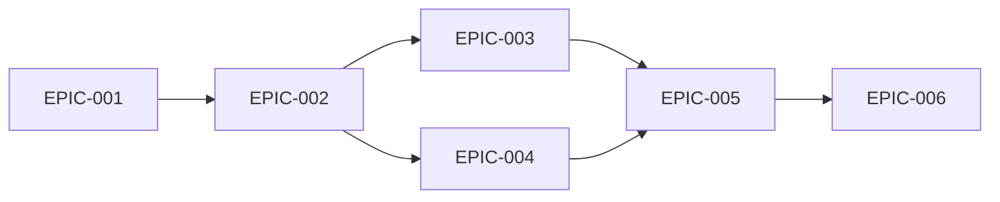

# POC Hackathon - Epic Planning

## 📊 Epic Structure for 8-Hour Hackathon

### EPIC-001: Project Foundation
**Priority:** P0 - Critical  
**Duration:** 1 hour  
**Description:** Set up project infrastructure and development environment

**Goals:**
- Initialize React TypeScript project
- Configure build tools and dependencies
- Set up version control
- Establish project structure

**Success Criteria:**
- Development environment running
- All team members can run project
- Base configuration complete

---

### EPIC-002: Design System & Branding
**Priority:** P0 - Critical  
**Duration:** 1 hour  
**Description:** Implement The Pink Blueberry brand identity and component system

**Goals:**
- Configure brand colors and typography
- Create reusable UI components
- Establish consistent styling patterns
- Implement responsive design tokens

**Success Criteria:**
- Pink (#ec4899) and Blue (#3b82f6) implemented
- Component library functional
- Consistent visual language

---

### EPIC-003: Booking System
**Priority:** P0 - Critical  
**Duration:** 3 hours  
**Description:** Build complete appointment booking flow

**Goals:**
- Multi-step booking wizard
- Service and stylist selection
- Calendar integration
- Form validation
- Booking confirmation

**Success Criteria:**
- 5-step flow functional
- Data persists between steps
- Validation prevents errors
- Confirmation displayed

---

### EPIC-004: E-Commerce Platform
**Priority:** P0 - Critical  
**Duration:** 2 hours  
**Description:** Create product catalog and shopping cart

**Goals:**
- Product display grid
- Category filtering
- Shopping cart functionality
- Checkout simulation

**Success Criteria:**
- Products displayed with prices
- Cart add/remove/update works
- Total calculation accurate
- Checkout flow complete

---

### EPIC-005: Content & Navigation
**Priority:** P1 - High  
**Duration:** 30 minutes  
**Description:** Build supporting pages and navigation

**Goals:**
- Homepage with hero
- Services catalog
- Team/stylists page
- Responsive navigation

**Success Criteria:**
- All pages accessible
- Mobile menu functional
- Content properly displayed

---

### EPIC-006: Testing & Documentation
**Priority:** P1 - High  
**Duration:** 30 minutes  
**Description:** Validate functionality and document project

**Goals:**
- Test all user flows
- Fix critical bugs
- Create README
- Prepare submission

**Success Criteria:**
- No blocking bugs
- README complete
- Submission ready

---

## 📈 Epic Dependencies

## 🎯 Risk Mitigation

| Risk | Impact | Mitigation |
|------|--------|------------|
| Time overrun | High | Strict timeboxing per epic |
| Scope creep | Medium | Focus on MVP only |
| Technical issues | High | Use familiar tech stack |
| Team coordination | Medium | Clear task assignment |

---

**Total Duration:** 8 hours  
**Critical Path:** EPIC-001 → EPIC-002 → EPIC-003/004 → EPIC-005 → EPIC-006